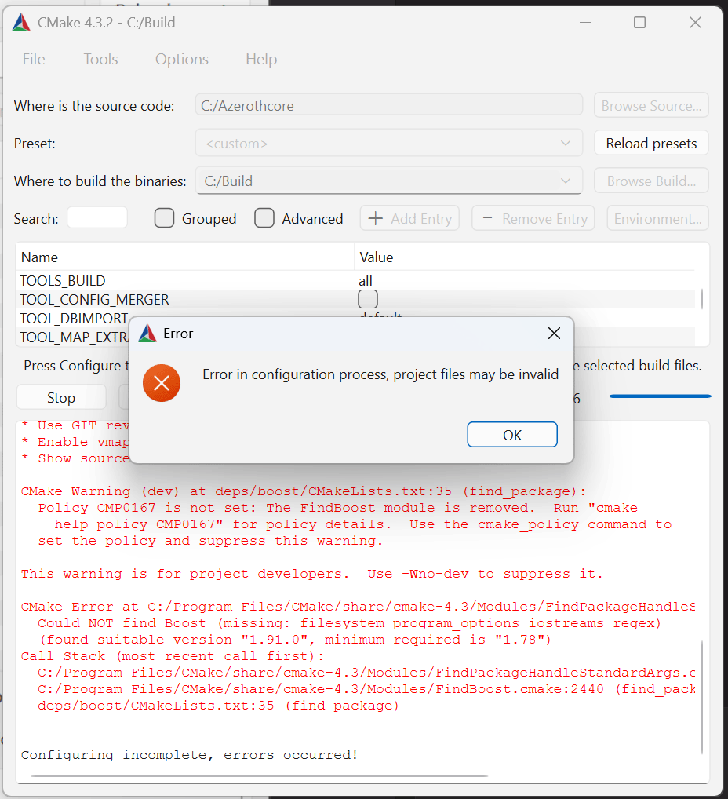
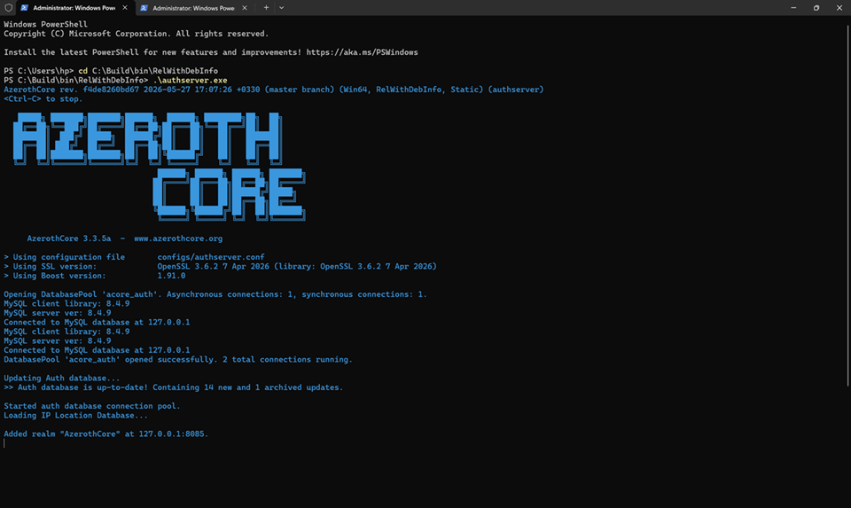
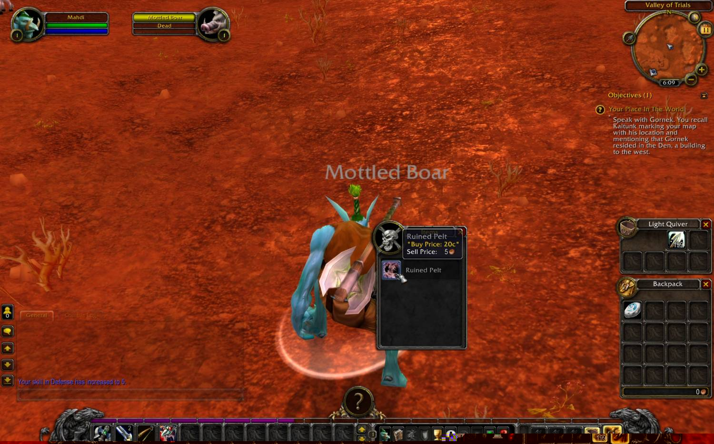
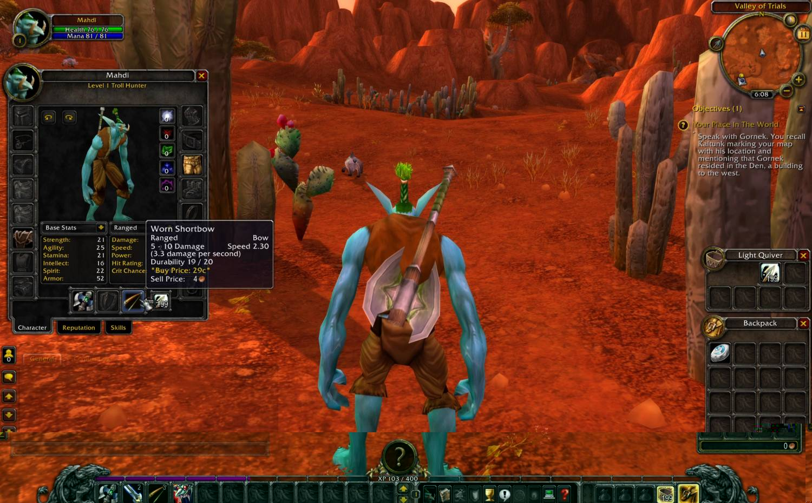
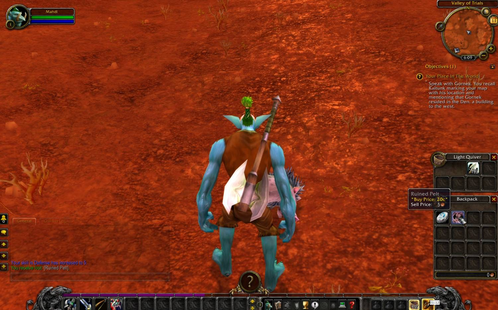

# تسک اول: اجرای AzerothCore

## نصب و راه اندازی
### مرحله 1: دریافت سورس پروژه

با git clone یک کپی از کدها بر روی سیستم خودم ایجاد کردم:
```bash
git clone https://github.com/azerothcore/azerothcore-wotlk.git
```

---

### مرحله 2: نصب پیش‌نیازها
طبق داکیومنت اصلی AzerothCore پیش رفتم:

```
https://azerothcore.org/wiki/classic-installation
```

| نصب شده | ورژن |
|---|---|
| Git | `2.54.0` |
| CMake |`4.3.2` |
| Visual Studio |`18 2026` |
| Boost |`1.91.0` |
| MySQL |`8.4.9` |
| OpenSSL | `3.6.2` |


---

### مرحله 3: ساخت Build Directory

- پوشه کدها: `C:/Azerothcore`
- پوشه بیلد:  `C:/Build`


---

### مرحله 4: CMake

در محیط گرافیکی CMake:
```text
Source:    C:/Azerothcore
Build:     C:/Build
Generator: Visual Studio 18 2026

APP_AUTHSERVER=default
APP_WORLDSERVER=default
TOOLS_BUILD=all
MODULES=static
SCRIPTS=static
USE_MYSQL_SOURCES=OFF
CMAKE_INSTALL_PREFIX=C:/Program Files/AzerothCore
```


### خطایی که در این مرحله برخوردم و آن را رفع کردم



- warning مربوط به policy CMP0167
- پیدا شدن Boost 1.91.0
- پیدا نشدن componentهای filesystem، program_options، iostreams و regex

متن اصلی خطا:

```text
Could NOT find Boost (missing: filesystem program_options iostreams regex)
(found suitable version "1.91.0", minimum required is "1.78")

Configuring incomplete, errors occurred!
```
که پس از جستجو در اینترنت فهمیدم:
CMake نسخه‌ی Boost `1.91.0` را مناسب تشخیص داده، ولی componentهای زیر را پیدا نکرده است. با توجه به دستوراتی که با جستجو در اینترنت پیدا کردم، خطا را رفع کردم.

```text
filesystem
program_options
iostreams
regex
```


---

### مرحله 5: Build کردن پروژه
طبق مستندات رسمی AzerothCore دستور زیر را در پاورشل ویندوز اجرا کردم:
```powershell
cmake --build "C:\Build" --config RelWithDebInfo --parallel 1
```

---

### مرحله 6: آماده‌سازی DLLها و فایل‌های config

در این پروژه :


| نصب شده | ورژن |
|---|---|
| آدرس host | `127.0.0.1` |
| پورت MySQL | `3306` |
| نام کاربری | `acore` |
| رمز عبور | `acore` |

---
در مسیر `C:/Build/bin/RelWithDebInfo/configs/` فایل های زیر رو تغییر دادم:

- `authserver.conf`:

    ```ini
    RealmServerPort = 3724
    BindIP = "0.0.0.0"
    LoginDatabaseInfo = "127.0.0.1;3306;acore;acore;acore_auth"
    ```

- `worldserver.conf`:

    ```ini
    WorldServerPort = 8085
    BindIP = "0.0.0.0"
    LoginDatabaseInfo     = "127.0.0.1;3306;acore;acore;acore_auth"
    WorldDatabaseInfo     = "127.0.0.1;3306;acore;acore;acore_world"
    CharacterDatabaseInfo = "127.0.0.1;3306;acore;acore;acore_characters"
    ```

- `dbimport.conf`:

    ```ini
    LoginDatabaseInfo     = "127.0.0.1;3306;acore;acore;acore_auth"
    WorldDatabaseInfo     = "127.0.0.1;3306;acore;acore;acore_world"
    CharacterDatabaseInfo = "127.0.0.1;3306;acore;acore;acore_characters"
    Updates.EnableDatabases = 7
    Updates.AllowedModules = "all"
    Updates.AutoSetup = 1
    ```

---

### مرحله 7: راه‌اندازی MySQL
در پاورشل ویندوز اجرا کردم: (با دسترسی Administrator)
```powershell
Start-Service MySQL84
Get-Service MySQL84
```

خروجی که گرفتم:
```text
Status   Name      DisplayName
------   ----      -----------
Running  MySQL84   MySQL84
```

---

### مرحله 9: Import دیتابیس‌ها
فایل `C:\Build\bin\RelWithDebInfo\dbimport.exe` را اجرا کردم. پیام موفق داد:

```text
Applied 181 queries. Containing 1090 new and 1384 archived updates.
```

---

### مرحله 10: دانلود و تنظیم Data

AC Data v19 برای `enUS` در مسیر زیر استخراج شده:

```text
C:/Build/bin/RelWithDebInfo/Data
```
در `worldserver.conf`:

```ini
DataDir = "C:/Build/bin/RelWithDebInfo/Data"
```
نصب تموم شد

---

## اجرای azeroth core

### اجرای authserver
 در پاور شل به پوشه زیر رفتم و فایل `.exe` رو اجرا کردم.
```powershell
cd C:\Build\bin\RelWithDebInfo
.\authserver.exe
```

---

### اجرای worldserver

در یک PowerShell جدا:

```powershell
cd C:\Build\bin\RelWithDebInfo
.\worldserver.exe
```
طبق داکیومنت، چون به `AC>` رسیدم یعنی همه چی درست اجرا شده:

```text
WORLD: World Initialized In 0 Minutes 18 Seconds
worldserver-daemon ready...
AC>
```

---

### مرحله 13: ساخت حساب تستی


```text
account create USERNAME PASSWORD
account set gmlevel USERNAME 3 -1
```
اجرای سرور تمومه. حالا بریم با این اطلاعات از محیط بازی به سرور وصل شیم.

---

## اتصال کلاینت به سرور بازی

بازی World of Warcraft دقیقا نسخه `3.3.5a` را دانلود کردم. فایل های بازی رو  در `C:\Games\World of Warcraft - WoTLK\wotlk\` اکسترکت کردم. 

### تنظیم realmlist.wtf
فایل `C:\Games\World of Warcraft - WoTLK\wotlk\Data\enUS\realmlist.wtf` رو تغییر دادم:
```text
set realmlist 127.0.0.1
```

---

### مرحله 15: اجرای کلاینت و اتصال موفق

فایل `C:\Games\World of Warcraft - WoTLK\wotlk\Wow.exe` را برای اجرای بازی اجرا کردم.


---
---
---
---
---


# تسک دوم: نمایش قیمت داخل Tooltip آیتم

## قیمت آیتم از کجا میاد؟

جدول `item_template` توی دیتابیس world دو تا ستون اینجوری داره:

```sql
`BuyPrice` bigint NOT NULL DEFAULT '0',
`SellPrice` int unsigned NOT NULL DEFAULT '0',
```

که توی فایل زیر از کدها هست:
```text
data/sql/base/db_world/item_template.sql
```

معنای این دو فیلد:

| فیلد | کاربرد |
|---|---|
| `BuyPrice` | قیمت خرید آیتم |
| `SellPrice` | قیمت فروش آیتم |

واحد های پولی بازی: 

```text
100 copper = 1 silver
100 silver = 1 gold
10000 copper = 1 gold
```
یعنی باید برسیم به همچین چیزی:
```text
20      : 20c
129     : 1s 29c
10000   : 1g
10510   : 1g 5s 10c
```


### ارتباط دیتابیس و Tooltip

مسیر داده در سورس موجود به شکل زیر است:

1. در دیتابیس `acore_world` جدولی با اسم `item-template` وجود داره 
2. که فایل `ObjectMgr.cpp` اون رو فراخوانی میکنه. و با SQL مقادیر زیر رو SELECT میکنه: BuyCount, BuyPrice, SellPrice و موارد دیگه.
3. حالا به یه `ItemTemplate` برای BuyPrice و SellPrice نیاز داریم. توی فایل `ItemHandler.cpp`
4. حالا این فایل اطلاعات رو به `WoW Client Tooltip` ارسال میکنه. تا توی بازی نمایش داده بشه.

---

### پس باید `ItemHandler.cpp` رو تغییر بدیم:
 
```
src/server/game/Handlers/ItemHandler.cpp
```
این تابع اطلاعات یک آیتم بازی رو درخواست میده و سپس برای نشون دادن توی بازی آماده میکنه:
```cpp
WorldSession::HandleItemQuerySingleOpcode
```
---
### کد هایی که اضافه کردم:

```cpp
std::string FormatTooltipMoney(uint32 money)
```
یه تابع نوشتیم. که یه ورودی عددی ساده میگیره و باید تبدیلش کنه به فرمت قابل خوندن: `1g 5s 10c`

مثلا:
- اگه عدد 10510 رو به 10000 تقسیم کنیم 1 بدست میاد. پس میشه یه دونه طلا .
- حالا 510 باقی مانده رو برای نقره و کوپر نگه میداریم.
```cpp
uint32 gold = money / 10000;
money %= 10000;
```
- حالا 510 رو به 100 تقسیم میکنیم و 5 تا نقره بدست میاد.
- باقی مانده هم 10 هست که تعداد کوپر ها هست.
```cpp
uint32 silver = money / 100;
uint32 copper = money % 100;
```
1. حالا بررسی میکنیم که اگه gold داشتیم و صفر نبود، متنی مثل `1g` به خروجی اضافه بشه.
```cpp
if (gold)
{
    result += Acore::StringFormat("{}g", gold);
}
```
2. برای نقره بررسی میکنیم که اگه متن `1g` اضافه شده بود و طلا داشتیم، یه فاصله اضافه کنه که به هم نچسبن و اینجوری نشه: `1g5s10c`.
```cpp
if (silver)
{
    if (!result.empty())
    {
        result += " ";
    }
    result += Acore::StringFormat("{}s", silver);
}
```
3. برای کوپر هم همینجوری پیش میریم. فقط برای مقدار صفر خروجی رو خالی تحویل نمیده و `0c` رو میده.

```cpp
if (copper || result.empty())
{
    if (!result.empty())
    {
        result += " ";
    }
    result += Acore::StringFormat("{}c", copper);
}
```
حالا برای نمایش: اگه قیمت خرید 0 یا منفی نبود:
```cpp
if (pProto->BuyPrice > 0)
```
بررسی میکنه اگه توضیحات دیگه ای وجود داشت به خط بعدی میره با `\n` و متن قبلی رو خراب نمیکنه
```cpp
if (!Description.empty())
{
    Description += "\n";
}
```
حالا قیمت خرید رو توی توضیحات آیتم نمایش میدیم:
```cpp
Description += Acore::StringFormat(
    "Buy Price: {}",
    FormatTooltipMoney(uint32(pProto->BuyPrice)));
```
---
## خروجی توی بازی:

زیر آیتم ها قیمت خریدشونم هست توی دسکریپشن:





---